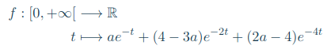

# 204ducks

When ducks are disturbed by a sudden noise, they fly away almost simultaneously, leaving the pond empty.

Chances that a duck will then come back after *t* minutes are given by the following probability density function:



Where *a* is a real constant between 0 and 2.5

The program display the following given the value of *a*

1. The average time after which ducks come back,
2. The standard deviation of the ducks’ return time,
3. The time after which 50% of all of the ducks are back,
4. The time after which 99% of all of the ducks are back,
5. The percentage of ducks that come back after 1 minute,
6. The percentage of ducks that come back after 2 minutes.

## Compile

The project compile with *Makefile*:

For compile the project use the commande:

```console
foo@bar:~/204ducks$ make re
```

For clean the project use:

```console
foo@bar:~/204ducks$ make fclean
```

Get instruction with:


```console
foo@bar:~/204ducks$ ./204ducks -h
```

Launch test with:

```console
foo@bar:~/204ducks$ make test
foo@bar:~/204ducks$ ./unit_test
```
